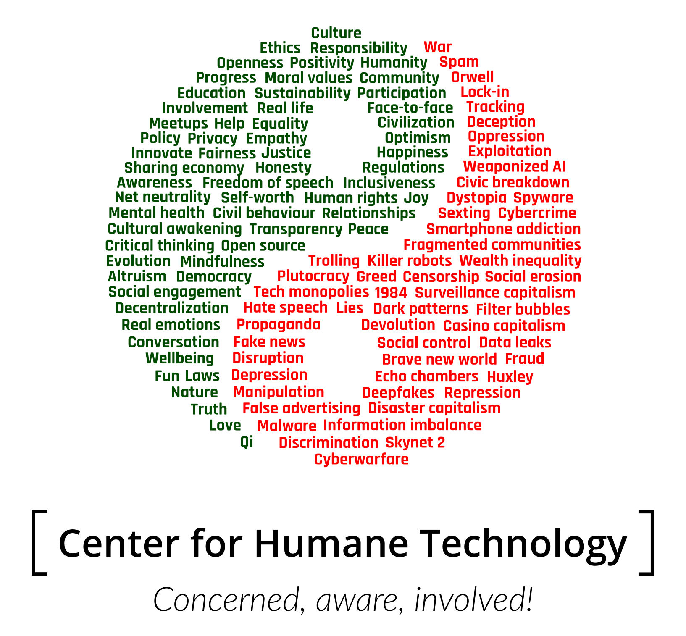

# The Rise of Yang

This is the second submission to the Design Contest, and it is designed by Arnold Schrijver ([aschrijver](https://community.humanetech.com/u/aschrijver/summary))

Our world is moving faster and faster driven by technological advances. Life and lifestyles are changing rapidly as we have to adapt to all this change. In today's world disruption has become the norm, something to strive for. This is strange, because disruption has a negative connotation.

Inventions are introduced to society without much thought about their implications, the ways in which they affect us as human beings. Our prevalent economic models are solely based on making a profit, and achieving infinite growth. As renegade economist [Kate Raworth](https://www.kateraworth.com/blog/) has so accurately phrased in her book [Doughnut Economics](https://www.kateraworth.com/blog/) _"No system in nature grows indefinitely!"_. Why then do we strive for this in our day-to-day lives? That is just utterly foolish, and completely irrational!

Its therefore no wonder that we see lots of negative effects in our daily life. Our warped mindset on what constitues economic success is the root cause of many of humanity's big problems. At the start of the biggest technological revolution ever - a true turning point in human history - it is essential that we wake up and fight the negative forces that are on the rise. And bring our technology to positive use, create things of marvel and beauty. Because that is also within reach!

The design reflects this by using the ancient Chinese [Yin and yang](https://en.wikipedia.org/wiki/Yin_and_yang) symbol, in this case to show the opposite play between good versus evil in the light of tech-related and societal aspects that exist in our world. While Yin is becoming more prevalent in current reality, The efforts of The Center for Humane Technology - together with many, many others - will ensure that, ultimately, the good forces will prevail. Or - to put it in other words - to ensure that **Yang is on the rise**!

## The Yin and Yang of Humane Technology

Here are the (far from complete list of) negative and positive forces in textual form (and random order), so you can copy and use them in your own designs if you'd like:

| Yin (negative) | Yang (positive) |
| :--- | :--- |
| Greed | Conversation |
| Dark patterns | Real emotions |
| Surveillance capitalism | Social engagement |
| Plutocracy | Civil behaviour |
| Orwell | Freedom of speech |
| Huxley | Net neutrality |
| 1984 | Privacy |
| Brave new world | Security |
| Tracking | Happiness |
| Information imbalance | Mindfulness |
| Fake news | Critical thinking |
| Propaganda | Equality |
| Echo chambers | Human rights |
| Filter bubbles | Humanity |
| Sexting | Ethics |
| Trolling | Moral values |
| Spam | Responsibility |
| Data leaks | Real life |
| Censorship | Openness |
| Killer robots | Transparency |
| Weaponized AI | Open-source |
| Smartphone addiction | Fairness |
| Fragmented communities | Justice |
| Discrimination | Face-to-face |
| Hate speech | Meetups |
| Lies | Relationships |
| Manipulation | Self-worth |
| Tech monopolies | Thruth |
| Social control | Decentralization |
| Exploitation | Policy |
| Wealth inequality | Regulation |
| Civic breakdown | Cultural awakening |
| War | Involvement |
| Dystopia | Participation |
| Repression | Awareness |
| Spyware | Civilization |
| Malware | Progress |
| Cybercrime | Innovation |
| Cyberwarfare | Democracy |
| Lock-in | Wellbeing |
| Social erosion | Mental health |
| Disruption | Evolution |
| Devolution | Sustainability |
| Oppression | Honesty |
| Depression | Optimism |
| Fraud | Positivity |
| Casino capitalism | Qi |
| Disaster capitalism | Fun |
| Deception | Community |
| Skynet 2 | Love |
| False advertising | Altruism |
| Deepfakes | Help |
| | Nature |
| | Law |
| | Peace |
| | Culture |
| | Empathy |
| | Inclusiveness |
| | Joy |
| | Education |
| | Sharing economy |

## The submission

This submission was created in SVG format using open-source tools [Inkscape](https://inkscape.org/en/), [SVGO](), and [SVGOMG](https://github.com/jakearchibald/svgomg).

In order to make adaptations of this work, make sure to use the Inkscape version of the SVG and have the following Google fonts installed: [Rajdhani](https://fonts.google.com/specimen/Rajdhani), [Open Sans](https://fonts.google.com/specimen/Open+Sans) and [Lato](https://fonts.google.com/specimen/Lato).

## License

This artwork and related files use a different license than the default one for this repository. The additional restriction is that this original work is only intended for non-commercial use.

 "The Rise of Yang"</i> by <a xmlns:cc="http://creativecommons.org/ns#" href="https://github.com/aschrijver" property="cc:attributionName" rel="cc:attributionURL">Arnold Schrijver</a> is licensed under a <a rel="license" href="http://creativecommons.org/licenses/by-nc/4.0/">Creative Commons Attribution-NonCommercial 4.0 International License</a>.